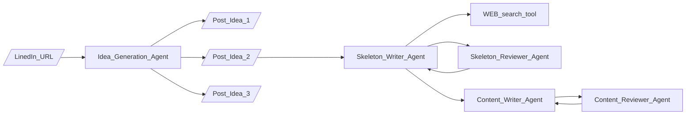

# Agentify: AI SMM Manager

Project for LLM Agents MOOC Hackathon hosted by Berkeley (<https://rdi.berkeley.edu/llm-agents-hackathon/>)

## Structure



## Setup

### Step 1
You should have a `.env` file in your root folder:
```
LINKEDIN_MAIL=...
LINKEDIN_PASSWORD=...
NEWSAPI_API_KEY=...
OPENAI_API_KEY=sk-proj-...
TAVILY_API_KEY=tvly-...
```

### Step 2
To run the app on the localhost:
1. check that you have streamlit installed:
```
$ which streamlit
>>> ...path.../streamlit

$ ...path.../streamlit version
>>> Streamlit, version 1.40.0
```
2. run on the localhost
```
streamlit run app.py
```